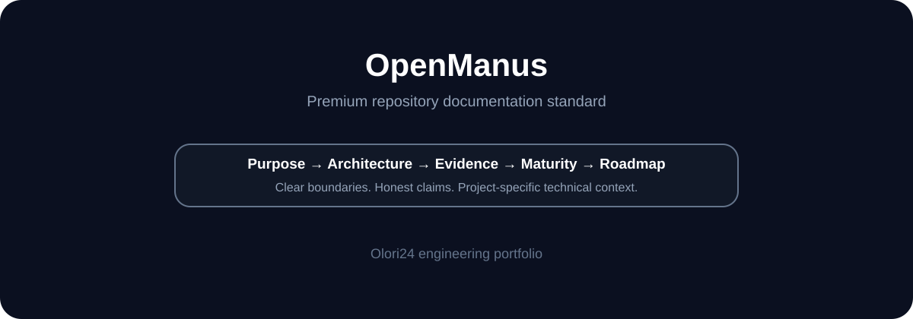

# OpenManus

**Moved upstream: this repository is retained as a pointer to the current project.**

## Documentation standard

This repository follows the portfolio README standard while preserving its actual status as a moved project.

## Current status

The OpenManus project has moved. The authoritative current source and project information are maintained by the upstream project.

**Current repository:** FoundationAgents/OpenManus

An archived version is also maintained at mannaandpoem/OpenManus_Archive.

## Important boundary

This Olori24/OpenManus repository should not be treated as the authoritative development location for OpenManus. New development, issues and project information should follow the upstream repository.

## Maturity

| Area | Status |
|---|---|
| Repository pointer | IMPLEMENTED |
| Current upstream source | External / upstream |
| Local application development | Not claimed |
| Production deployment | Not claimed |
| Tests | Not claimed |
| Roadmap | Maintained upstream |

## License

Refer to the authoritative upstream repository for current licensing information.

---

**Repository status: moved upstream.**

